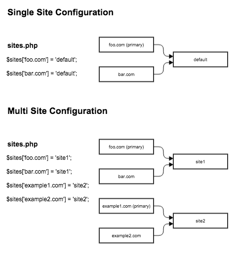
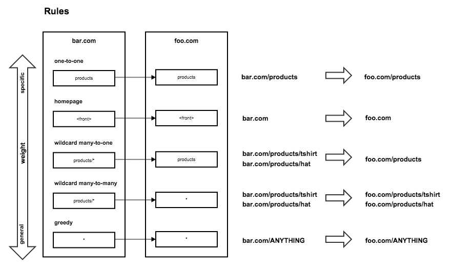

Multisite Redirect
======================

Multisite Redirect is a system designed to allow users to create and manage URL redirects across domains in a sort of multisite configuration. The primary use case for this module is one where a client might have multiple domains that are being consolidated into a single site. In this scenario not only will the domains be different, but the URLs associated with them as well. Rather than killing all of the obsolete URLs from an old domain, you can drive all of the SEO juice to the primary site. With this module you can define rules that will redirect certain patterns of URLs on certain sites to be redirected somewhere else.

Installation 
------------

- Install this module using the official Backdrop CMS instructions at
  https://docs.backdropcms.org/documentation/extend-with-modules.

- After enabling the module, you'll need to setup your sites/sites.php file by pointing all of the domains that are to be managed by this module, at the primary site. In many cases this may just be "default" if you're not running a true multisite setup.

- If you are using this module on a site that is not a true multisite setup (all domains in sites/sites.php point to default), ensure that your settings.php file is in web/sites/default, and not in the web/ directory. This indicates that your site is "multisite" while only having one site.

Documentation
-------------

### Configuration Examples:

After enabling the module, you'll need to setup your sites/sites.php file by routing all of the domains that are to be managed by this module, to the primary site. In many cases this may just be "default" if you don't intend to run a true multisite setup. Get more information on how to setup your sites.php file.

Configure the primary site and any exclusions that you may have. Exclusions are domains where you want redirect rules to be disabled.

### Setup your redirect rules.

The concept behind this module is to create "rules" or pattern based redirects to consolidate links from one domain to another. When a page is visited, this module will parse through the list of redirect rules and the first rule pattern that matches the visitors source path will fire. You'll probably want to weight the rules from more specific to more general otherwise the more specific patterns may not fire correctly.

Here are some examples of the the different types of rules you may setup.

### One-to-one

One-to-one rules are the most specific and simplest types of rules. These are a very literal and will handle redirects from a specific source path to a specific destination on the primary domain.

`products --> products`
`<front> --> <front>`

### Many-to-one

Many-to-one rules will funnel many source paths matching a pattern into a specific destination.

`products/* --> products`

### Many-to-many

Many-to-many rules will match a pattern of source paths and will redirect visitors to the matching path on the destination site. Wildcards in the destination path represent the entire source path and should be used as such. For example, attempting to redirect the user from `products/*` to `store/product/*` will not work as expected.

`products/* --> *`

### Greedy

Greedy rules are the most general type of rules and should always be last in the rule list. Using a wildcard in the source path in this way will match against any path on the source site.

`* --> *`

Issues
------

Bugs and feature requests should be reported in [the Issue Queue](https://github.com/backdrop-contrib/multisite_redirect/issues).

Current Maintainers
-------------------

- [Eli Lisseck](https://github.com/elisseck).
- [Anthony Nemirovsky](https://github.com/anemirovsky).

Credits
-------

- Ported to Backdrop CMS by [Lauren Blais](https://github.com/rlblais), [Anna Heath](https://github.com/aheath)
- Porting to Backdrop CMS development sponsored by [USENIX](https://www.usenix.org/).
- Originally written for Drupal and maintained by [Ian Whitcomb (iwhitcomb)](https://www.drupal.org/u/iwhitcomb).

License 
-------

multisite_redirect is GPL v2 software.
See the LICENSE.txt file in this directory for complete text.
